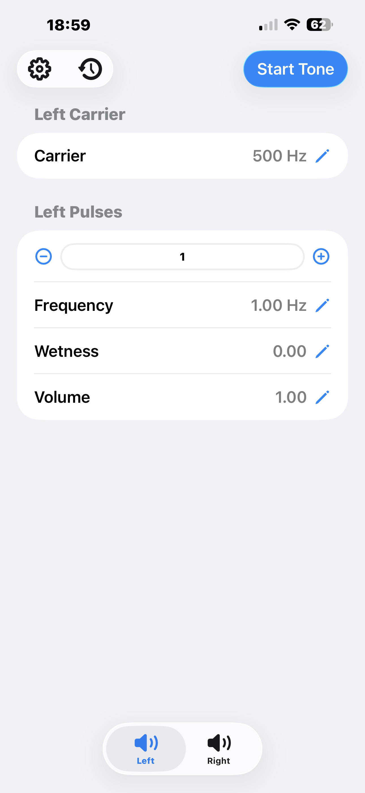
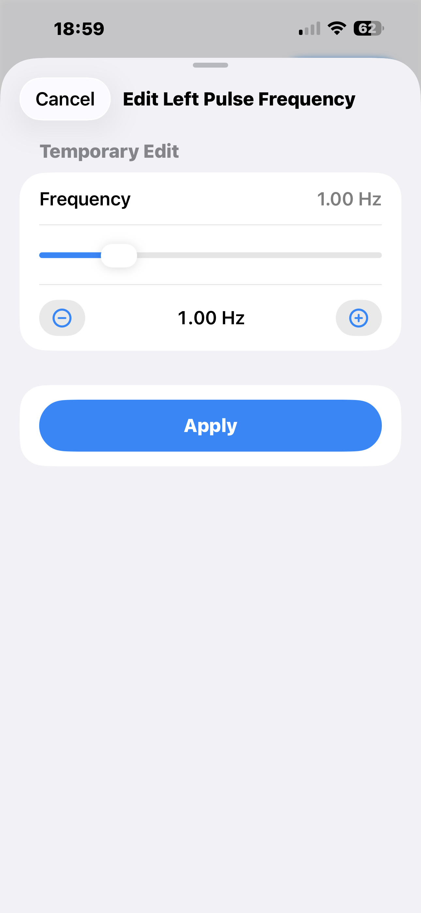
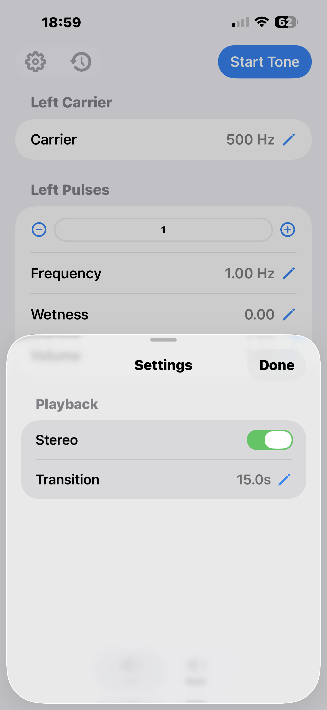
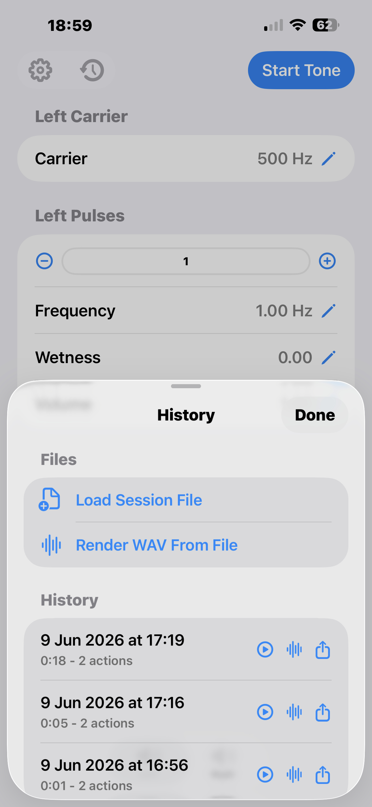
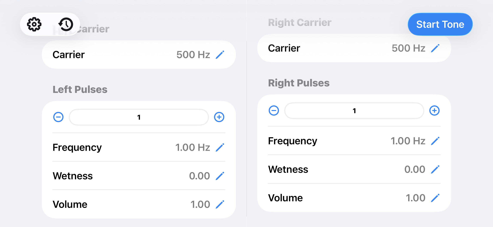

# Wave generator

Wave generator is an iOS app for continuously synthesizing a smooth audio tone with one or more pulse envelopes. It is designed around one practical rule: changing a sound parameter while audio is running should not create a click, jolt, phase reset, or abrupt level step.

The app is aimed at people who are comfortable with audio concepts such as carrier frequency, envelopes, modulation depth, ramps, stereo channels, and rendered WAV files. You do not need to know the codebase to understand or use the app.

> Audio safety: set a comfortable device volume before playback, be careful with headphones or external amplification, and do not treat the app as calibrated measurement, medical, or hearing-test equipment.

## Screenshots

<p>
  
  
  
  
</p>

<p>
  
</p>

## What the app generates

At its simplest, the output is a sine carrier:

```text
carrier(t) = sin(carrierPhase)
```

Pulse layers multiply the carrier by unipolar envelopes. A pulse oscillator is converted from sine to `0...1`:

```text
pulse(t) = (sin(pulsePhase) + 1) / 2
```

The pulse's wetness control sets the depth of that envelope:

```text
envelope(t) = wetness + (1 - wetness) * pulse(t)
```

`wetness = 1` gives a constant tone with no pulsing. `wetness = 0` gives full-depth pulsing from silence to full level.

Pulse volume is a contribution control rather than a simple post-fader. Internally the pulse is blended between neutral multiplication and its full envelope:

```text
pulseContribution(t) = 1 + volume * (envelope(t) - 1)
```

So `volume = 0` means "this pulse has no effect" and `volume = 1` means "use the full envelope." Multiple pulses are multiplied together:

```text
output(t) = masterGain(t) * carrier(t) * product(pulseContribution[i](t))
```

The carrier is always present and is clamped to at least `200 Hz`. Pulse frequencies are independent and editable in the `0...5 Hz` range. (If a pulse frequency is zero, that just means it outputs the carrier frequency as a constant tone.) Final samples are clamped to `-1...1` before output.

## Why changes stay smooth

The central design is that live edits are not applied as instantaneous value jumps. When audio is playing, a parameter edit schedules a timed ramp in audio sample-frame time.

Each ramp records:

```text
startFrame
endFrame
startValue
targetValue
```

For every rendered sample, the engine asks the parameter for its value at the current audio frame. During a ramp the value is linearly interpolated between `startValue` and `targetValue`; after `endFrame` it settles on the target.

Two details matter:

- Ramps use audio frame positions, not wall-clock timers. That keeps automation deterministic and tied to the audio stream.
- If a new edit arrives while an earlier ramp is still moving, the new ramp starts from the current interpolated value at that exact frame. It does not jump back to the old settled value.

Start and stop are handled the same way through `masterGain`, so playback fades in and out over the configured transition time. Carrier changes, pulse frequency changes, wetness changes, and pulse volume changes all use the same ramp machinery while the tone is running.

When the tone is stopped, parameter edits apply immediately because there is no audible signal to disturb.

## Using the app

Use the `Start Tone` button to begin output. Use it again to stop; stopping fades the master gain down over the transition duration.

Tap the pencil next to `Carrier` to set the carrier frequency. The editor gives a slider, small nudge buttons, and an explicit `Apply` button. The main screen shows committed values, not half-finished slider drags.

The `Pulses` section lets you add or remove pulse layers, select a pulse by number, and edit its frequency, wetness, or volume. New pulses are created at zero contribution, so you can tune frequency and wetness silently before raising volume. Removing a pulse ramps its contribution back to neutral before it disappears.

The gear button opens playback settings:

- `Stereo` gives separate left and right channel settings.
- `Transition` sets the ramp length for live edits and start/stop fades. The current range is `5...30 seconds`.

In stereo mode, wide layouts show both channels side by side; narrower layouts use a left/right tab selector. Each channel has its own carrier and pulse list.

## Sessions, replay, and WAV rendering

Completed playback sessions are saved as compact timelines, not as captured PCM. The app stores the starting settings snapshot plus accepted audio-changing actions at frame offsets from the start of playback.

That means a session file is closer to a deterministic performance score than a recording. It contains:

- format version
- sample rate
- duration in frames
- initial carrier, pulse, stereo, and transition settings
- events such as start, stop, carrier change, pulse change, pulse add, and pulse remove
- each event's frame offset and transition frame count

The history button opens previous sessions. From there you can replay a session, export its JSON timeline, or render it offline to a WAV file. You can also load an exported JSON session file for playback, or render a WAV directly from a session file.

Imported session files are validated before playback or rendering. The validator checks things like sample rate, frame counts, required start events, carrier limits, pulse ranges, and pulse indices.

During session-file playback, the app temporarily applies the session's initial settings, runs the frame-offset event timeline, shows the remaining time, and restores your previous settings afterwards.

## Implementation notes

The live audio path uses `AVAudioEngine` and an `AVAudioSourceNode`. UI actions enqueue fixed-size commands into a lock-free ring buffer, and the render callback drains those commands into the audio state. This keeps locks and UI work out of the real-time render path.

Each channel owns a list of components:

- one mandatory bipolar sine carrier
- zero or more unipolar pulse components

Each component owns its own phase and ramped parameters, so pulses are independent of the carrier and of each other. The final channel amplitude is the product of component amplitudes multiplied by master gain.

More detailed design notes live in [`docs/`](docs/):

- [`docs/RefinedProjectBrief.md`](docs/RefinedProjectBrief.md)
- [`docs/ComponentArchitecture.md`](docs/ComponentArchitecture.md)
- [`docs/SessionNotes.md`](docs/SessionNotes.md)

## Building

Open `WaveGenerator.xcodeproj` in Xcode and run the `WaveGenerator` app target on an iPhone, iPad, or simulator. The app is written in SwiftUI and AVFoundation.

